# Disk Saver

<a class="docs-manual-back-link" data-docs-href="/docs/#/?id=_15-disk-saver" href="README.md#15-disk-saver">Back to the Pinokio feature overview</a>

<video controls playsinline preload="metadata" poster="media/disk-saver/universal-disk-saver.png" data-docs-poster="/docs/media/disk-saver/universal-disk-saver.png" width="1920" height="1080" aria-label="Pinokio Disk Saver demonstration">
  <source src="media/disk-saver/disk-saver-demo.mp4" data-docs-src="/docs/media/disk-saver/disk-saver-demo.mp4" type="video/mp4">
  Your browser does not support embedded video. <a href="media/disk-saver/disk-saver-demo.mp4">Open the Disk Saver demonstration</a>.
</video>

Disk Saver finds large files with identical contents and lets them share physical storage. Apps keep their normal files, names, and folder structures, so they do not need a central model library or Disk Saver-specific configuration.

> **Screenshot note:** Some screenshots below show the former **Unused files** label. In current Pinokio, that view is **Trash** and its removal action is **Empty Trash**; the workflow is otherwise the same.

> **Scan is read-only.** **Deduplicate**, **Make separate**, and **Empty Trash** change files on disk. Disk Saver saves local storage; it is not a backup.

## Overview

### What problem does it solve?

AI apps often download their own copies of the same models, runtimes, Python and Node packages, libraries, archives, datasets, and other large files. Those copies can consume hundreds of gigabytes while remaining difficult to share through app-specific settings or a central library.

Disk Saver finds byte-identical files wherever you choose to scan, even when their names and paths differ.

### The solution

Every app keeps its existing files and folder structure while exact matches share one physical copy underneath. There is no central models folder, shared-cache convention, or app-specific integration to configure.

Disk Saver only offers deduplication when files contain the exact same bytes and pass its safety checks. Matching names or locations are not enough.

### What it looks like

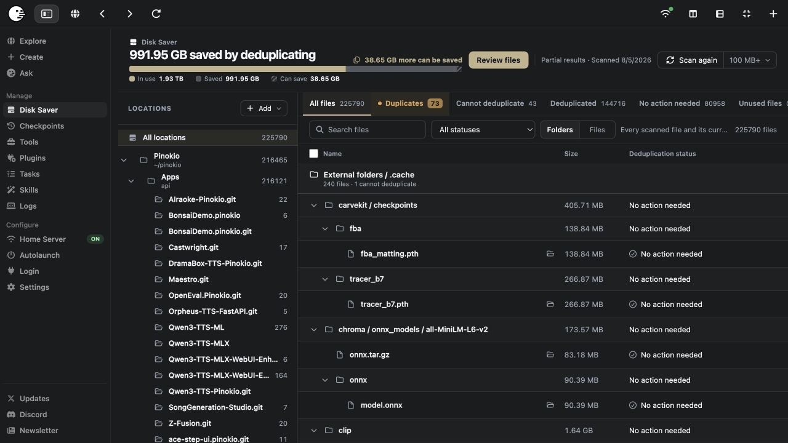

The global Disk Saver page combines scan controls, storage totals, locations, result views, and completed activity in one place.

### How scanning works

- **Pinokio Home scan:** Finds redundant files across installed apps in your Pinokio Home.
- **App-specific scan:** Scans and reviews one installed app in context.
- **Other folders:** Adds model libraries, caches, archives, old Pinokio Homes, datasets, external drives, or other folders you control.

Scanning reads file information and hashes possible matches. It does not link, replace, or delete files.

### How deduplication works

When you choose **Deduplicate**, every selected path remains in place. Disk Saver replaces redundant physical storage with hardlinks on the same filesystem, allowing several normal file paths to refer to the same underlying data.

Deleting one path removes only that path. The underlying data remains available through the other hardlinks until every path and managed reference has been removed.

### How safe is it?

- Scanning is read-only.
- Only byte-identical files can qualify for deduplication.
- Files are checked again immediately before Disk Saver changes them.
- **Make separate** restores a path to its own independent physical copy.
- **Empty Trash** is permanent, and deduplication is not a backup.

## Features

### 1. Run the first global scan

1. Open **Disk Saver** under **Manage** in the Pinokio sidebar.
2. Choose a minimum file size and run a scan. A larger minimum scans faster; a smaller minimum may find more savings.
3. Open **Duplicates** to review files that can safely share storage.
4. Select one or more files and choose **Deduplicate**.
5. Confirm that the files moved to **Deduplicated** and that the storage summary updated.

Start with one disposable duplicate if you want to become familiar with the workflow before processing a larger selection.

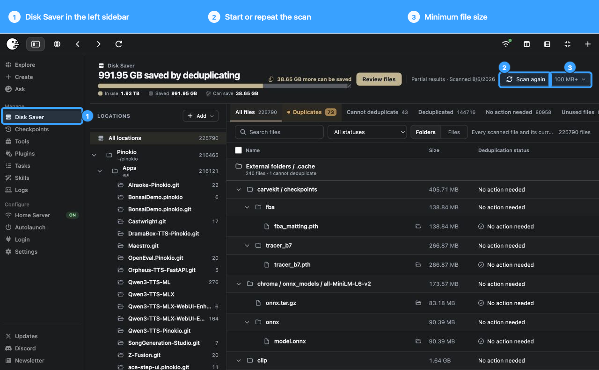

### 2. Understand the result views

| View | What it contains |
| --- | --- |
| **All files** | Every non-empty file included by the scan and minimum-size setting. |
| **Duplicates** | Byte-identical files that can safely share storage. |
| **Cannot deduplicate** | Matching files that failed a filesystem, access, metadata, or other safety check. |
| **Deduplicated** | Files already sharing physical storage. |
| **No action needed** | Files with no duplicate action to take. |
| **Trash** | Managed data no longer used by an app path and eligible for removal after verification. |
| **Activity** | A history of completed Disk Saver changes. |

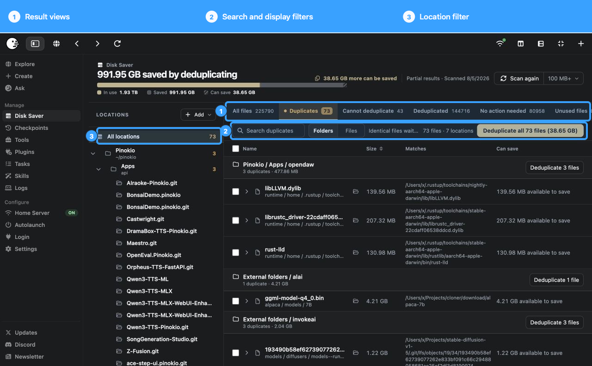

Search, filters, location selection, and the **Folders / Files** switch can narrow large result sets. A location-scoped action only applies to that location.

### 3. Read the scan summary

The storage summary separates three useful values:

- **In use:** Physical space currently occupied by managed files.
- **Saved:** Space already avoided through deduplication.
- **Can save:** Additional space available from eligible duplicates found by scanning.

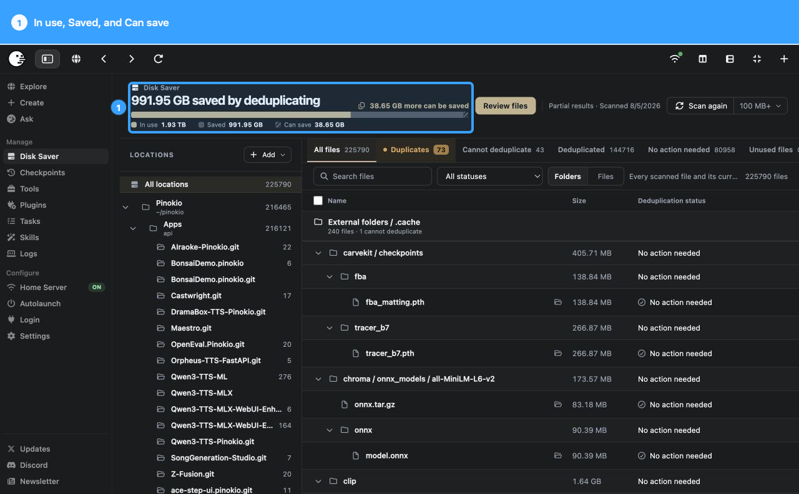

*These values are an example. Your totals will depend on the files you scan.*

### 4. Deduplicate one or many files

The **Duplicates** view groups byte-identical files and shows where each copy exists. You can act on a file, a selection, a folder, or an eligible location.

Before changing a file, Disk Saver verifies it again. It skips a file if it changed after the scan, belongs to a running Pinokio app, cannot be accessed, has incompatible metadata, or is on an unsupported or different filesystem.

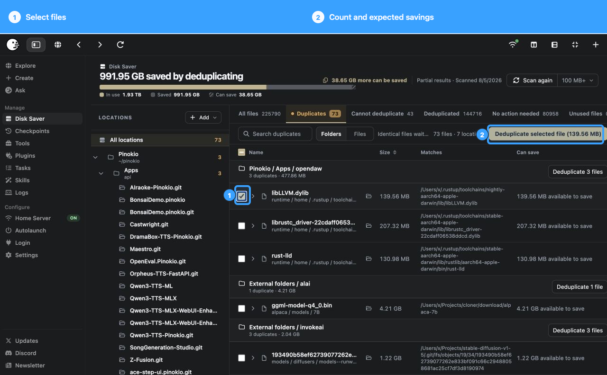

After deduplication:

- Every selected path still exists.
- The contents and checksums remain the same.
- The paths share physical storage through hardlinks.
- The completed action appears in **Activity**.

### 5. See why a file cannot be deduplicated

Matching contents are not enough. Files must also have compatible permissions, ownership, filesystems, metadata, and access. Disk Saver puts unsafe matches under **Cannot deduplicate** and explains the reason.

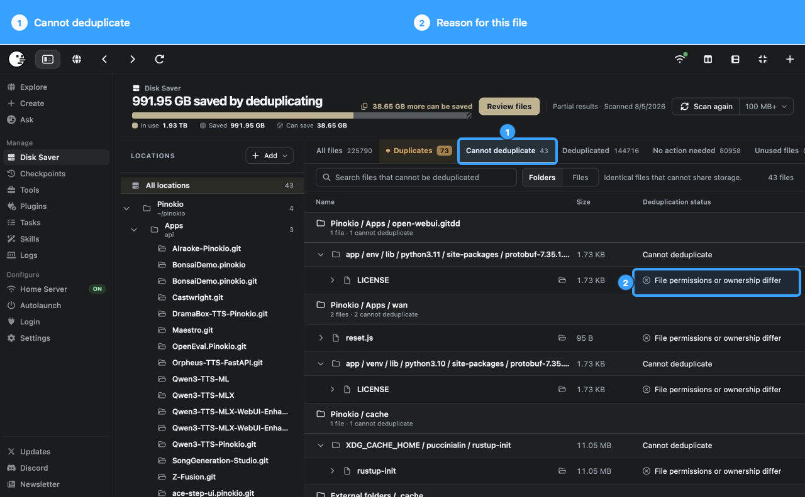

Fix a temporary access problem only when you understand it, then scan or try again. One unreadable path does not prevent the rest of a scan from completing.

### 6. Make a file separate again

**Make separate** gives a deduplicated path its own physical copy without changing its name or location. Use it before editing a file in place, creating an independent archive, or taking a path out of shared storage.

Making a file separate may require free space equal to the full file size. The file contents remain unchanged, but the new copy no longer shares physical storage with the other paths.

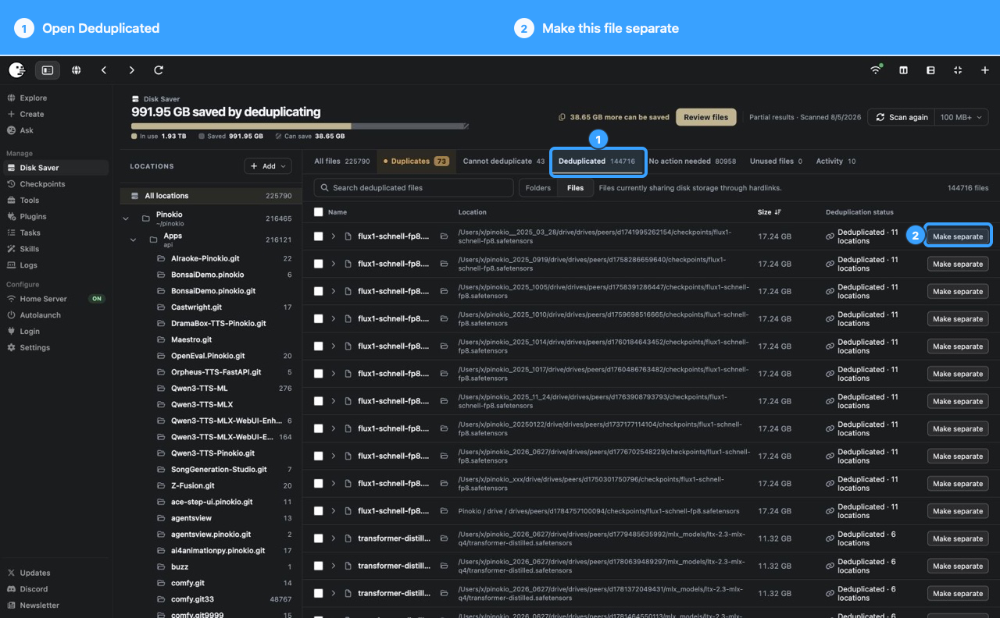

### 7. Use Trash and Empty Trash

Deleting an app removes that app's paths. Other apps continue working while they still have paths to the same data.

After the final app path is removed, unused managed data can appear in **Trash**. Review its size and contents before choosing **Empty Trash**. Disk Saver checks that the data is unchanged and unused before permanently removing it.

Unlike **Make separate**, emptying Trash is a deletion and is not an undo operation. Keep an independent backup of anything you cannot replace.

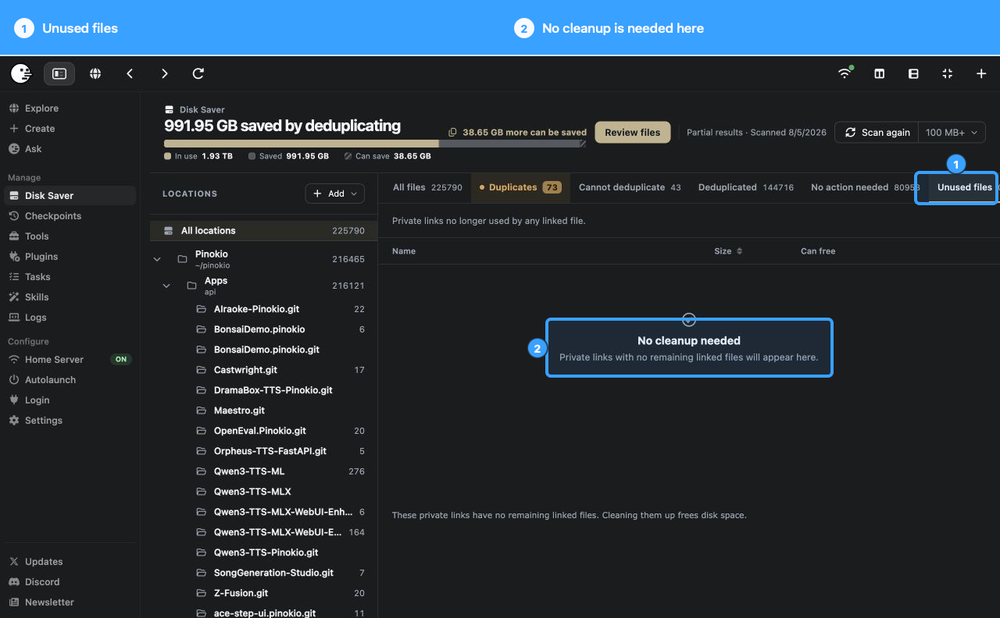

### 8. Add folders outside Pinokio Home

Add folders you control, including model libraries, download caches, project archives, old Pinokio Homes, datasets, or folders on an external drive. Removing a location from Disk Saver stops tracking it; it does not delete the folder.

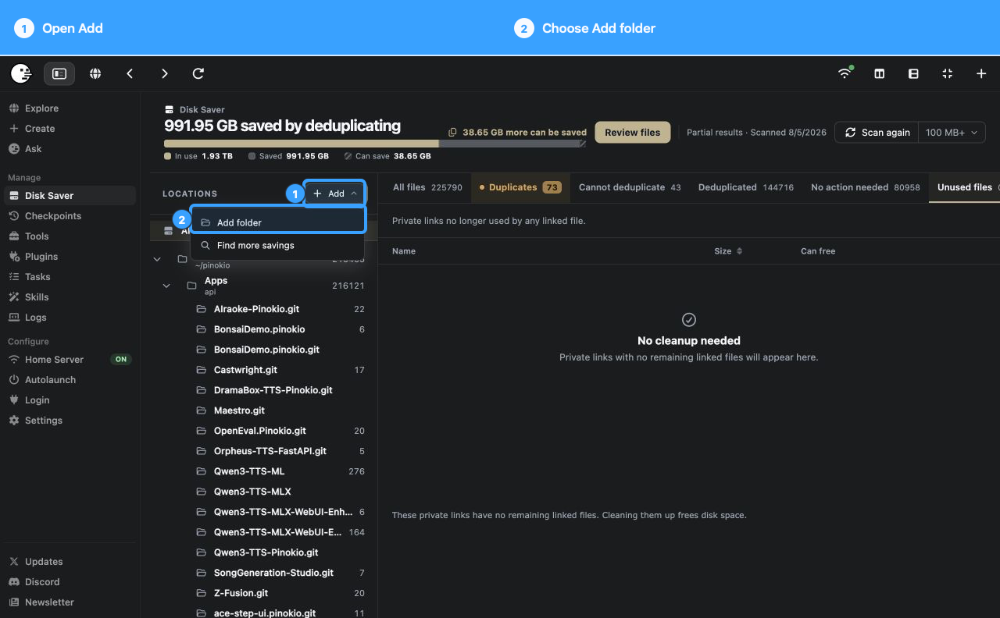

Files can only share storage with compatible files on the same filesystem. Disk Saver can manage several drives, but it cannot deduplicate a file on one drive against a file on another.

### 9. Find more savings elsewhere

Use **Find more savings** on a result to identify other folders where matching files may be using additional storage.

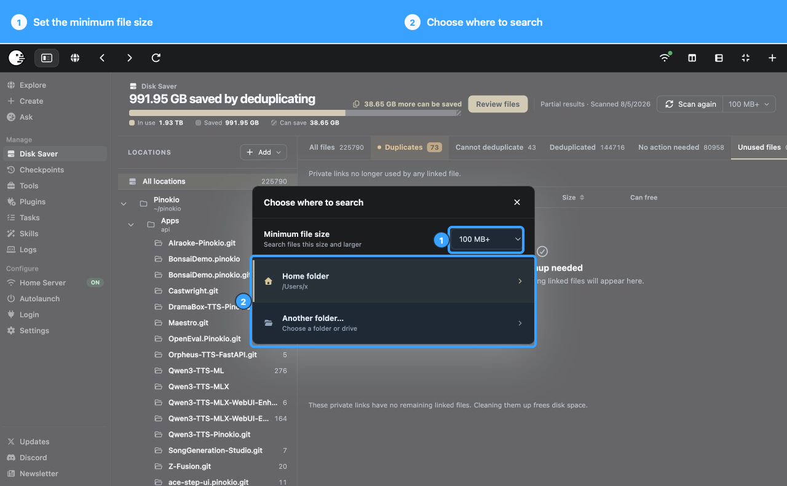

This is useful when a model or runtime appears inside both a Pinokio app and a separately managed library, cache, workspace, or archive.

### 10. Scan one app

Each installed app has its own Disk Saver view. App-specific actions stay scoped to that app while still comparing its files with verified matches found elsewhere.

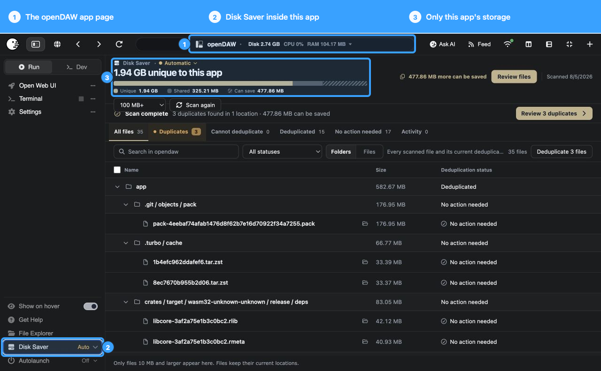

### 11. Use Autoscan

On macOS and Windows, an app can use **Automatic** or **Manual** checking. Automatic mode watches which eligible files the app changes, then checks for new verified matches after the app stops.

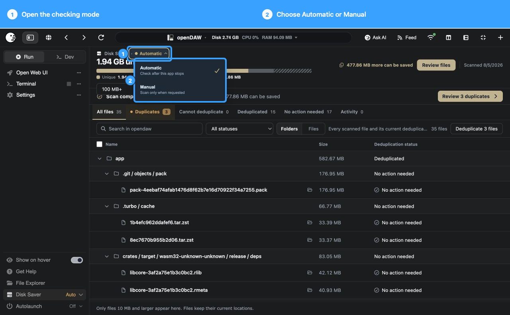

Autoscan never deduplicates files by itself. When it finds something new to review, Disk Saver displays a notification. Open the result and decide whether to act.

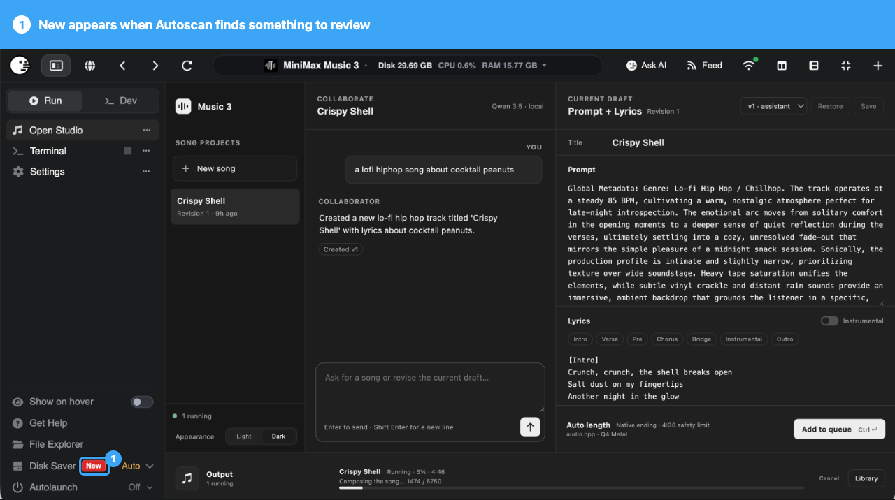

### 12. Review Activity and skipped files

**Activity** records completed Disk Saver changes so you can see what happened, when it happened, and which path was involved. It is an audit history, not an undo button.

If Disk Saver skips a path during a change, review the reason shown in the results. Files may be skipped because they changed after scanning, belong to a running app, cannot be accessed, or no longer pass the safety checks.

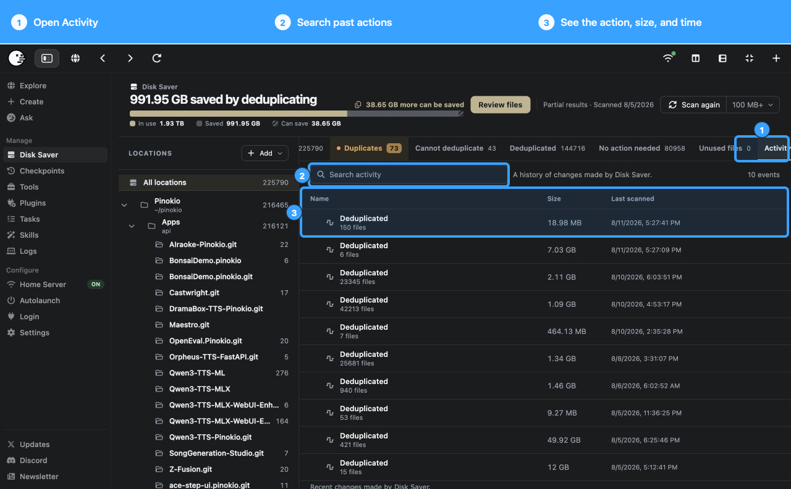

## Use cases

### One model used by several AI apps

ComfyUI, InvokeAI, trainers, audio tools, and custom launchers may each download the same checkpoint. Disk Saver lets every app keep its expected path while exact matches share physical storage.

### Repeated environments and runtimes

Apps often install the same PyTorch wheels, CUDA libraries, Python packages, Node or Electron binaries, FFmpeg builds, and browser runtimes. Large, stable dependencies can be strong deduplication candidates.

### Old Pinokio Homes and rollback folders

Old and current Pinokio Homes can contain repeated models and runtimes. Add the old folders and scan their stable overlap. Folders on different drives cannot share storage with one another.

### Caches, downloads, and archives

Hugging Face caches, app caches, download folders, installers, datasets, and finalized media libraries can contain large duplicate files under different names. Add only locations you understand and review the matches before acting.

### Portable workspaces on external drives

Several self-contained workspaces on one compatible external drive can share duplicate storage while retaining their independent directory trees. The saved space remains on that drive.

## How Disk Saver works

### What a hardlink means

A hardlink is another normal file path that refers to the same underlying data on disk. Every path keeps its own name and location, but the shared bytes occupy physical storage only once.

Deleting one hardlinked path does not delete the others. Editing the shared bytes in place is different: every hardlinked path sees the changed contents. Use **Make separate** before editing a writable file independently.

### Safety checks

- **Exact contents only:** Disk Saver narrows possible matches using file information, then hashes candidates with SHA-256. Only byte-identical files qualify.
- **Same filesystem only:** Hardlinks cannot cross filesystem boundaries. External drives must use a filesystem that supports hardlinks.
- **Writable files need care:** Models, archives, runtimes, and other read-only files are the safest candidates. Choose **Make separate** before editing.
- **Changed or active files are skipped:** Disk Saver rechecks files before acting and avoids files that changed after scanning or belong to running Pinokio apps.
- **Permissions and metadata matter:** Identical contents may still appear under **Cannot deduplicate** when ownership, permissions, filesystem support, or access checks are incompatible.
- **Disk saving is not backup:** Deduplication reduces redundant local storage; it does not create an independent recovery copy.

## Frequently asked questions

### Do file names or paths change?

No. Apps continue using the same paths.

### Does deleting one deduplicated path delete the others?

No. Deleting one path removes that path; the data remains available through other hardlinks. Editing the shared bytes in place is different, so make writable files separate first.

### Why is an identical file under Cannot deduplicate?

The contents match, but another safety check failed. Review the reason shown for permissions, ownership, filesystem support, different drives, denied access, or a file that changed after scanning.

### Can Disk Saver deduplicate across drives?

No. Hardlinks cannot cross filesystem boundaries. Files can only share storage with compatible files on the same drive and filesystem.

### Is scanning destructive?

No. Scanning reads file information and hashes possible matches. Only **Deduplicate**, **Make separate**, and **Empty Trash** change files.

### Can I stop using Disk Saver?

Yes. Use **Make separate** for paths that should become independent. Removing a tracked location stops managing it but does not delete its files.
